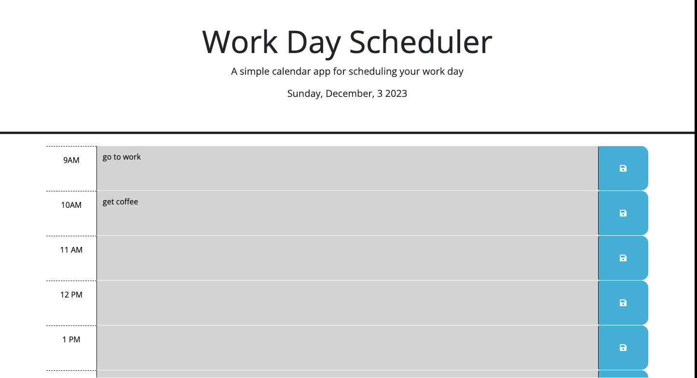

# week5work
manyanara.github.io/week5work

## Description

Provide a short description explaining the what, why, and how of your project. Use the following questions as a guide:

This is a work day scheduler that saves events and fixes them using local storage. Current hours are marked in green, future time slots are read and past slots are grey.

## Installation

To view my project go to:
manyanara.github.io/week5work
in your web browser.

## Usage

Enter your events in the timeslots according to their time. 
Click the save button when you're finished.
The page should reload every 30 minutes to update time and color.

## Credits

HTML, JS instructions and CSS were provided by UCBerkeley/EDx bootcamp. 

## How to Contribute

If you created an application or package and would like other developers to contribute to it, you can include guidelines for how to do so. The [Contributor Covenant](https://www.contributor-covenant.org/) is an industry standard, but you can always write your own if you'd prefer.

The website should look like: 
